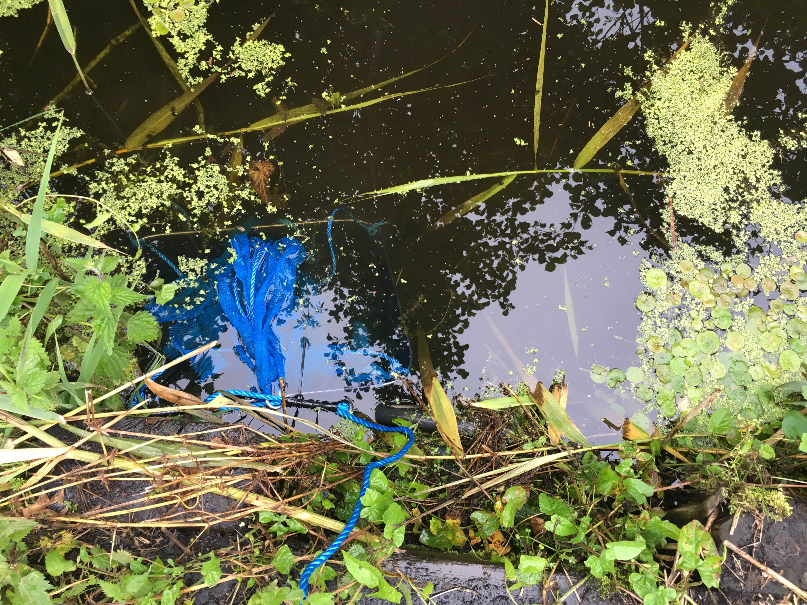

## Supported by 

## Acknowledgements

## Introduction

[//] 2 paragraphs

## Health and Safety

A laminated copy of the full survey risk assessment can be found here [electronic link location] as well as in the survey kit. Please adhere to the following;
•	Ditches and streams, particularly those as part of modified systems with water control structures can present a significant health and safety risk
•	Volunteers must not work alone when checking nets. Checks should be made in at least pairs
•	Weather-appropriate clothing and equipment, such as waterproofs, hat, and/or sun-cream should be worn

## European Eels on Avalon Marshes Reserves
[//] What work has been done before to survey for and protect Eels on the Avalon Marshes reserves and the South West (Westcountry Rivers Trust v)
[//] What do we already know about the distribution and status of European Eels on the Avalon Marshes Reserves. 
[//] Present data from RSPB as a time series

#  Methodology
## Ballerina skirt design 

[//] 1 paragraph on Ballerina skirt design

The first known uses of the 'Ballerina skirt' net design for surveying glass eel obstruction by water control structure are by Westcountry Rivers Trust and the Agri-food and Bio-sciences Institute for NI. 

https://wrt.org.uk/project/glass-eel-citizen-science/

Westcountry Rivers Trust implemented the Ballerina Skirt design at tidal pinch points as a trial for sampling glass eels. These pinch point sites were areas where the eels will gather to ascend a barrier or tidal confluence, such as tidal flood gates, weirs, etc. The young eels were attracted to the fresh water outputs and big tides brought them up the rivers searching out a home where they can continue to grow and develop through further life stages.

The method involves a vertical drop net, otherwise known as the ballerina skirt, that provides refuge for eels while they wait out the tide to access their new habitats, the net bundle is lowered into position and checked regularly through a tidal period, and once high tide is reached the eels will likely continue upstream and leave the refuge of the nets. The drop nets create a refuge for glass eels to hide away within the tidal limit whilst awaiting more preferable conditions, therefore, SWT's recent work may represent one of the first efforts to use Ballerina skirts inland.

SWT made their own nets for surveying glass eel migration into the Catcott Nature Reserve from keep nets, cable ties and polypropylene rope. A trial net was deployed in order to inform design changes that would be made when making future nets. Initially two sections of the keep net were used to create one ballerina skirt. This was found to be excessive since the height of the actual catch never exceeded that of a single section (~20cm). Including two sections of the keep net in the ballerina skirt design made the weight difficult to lift out of the water and often became caught in marginal vegetation hindering retrieval of the net for checking by volunteers.

[//] Photos, photos, photos

[//] 1 paragraph on Ballerina skirt deployment
  
In contrast to the pipe net, the ballerina skirts were considered to be semi-permeable. 

Location map using ggmap

1.	Collect survey kit from the Avalon Marshes Centre workshop
2.	Arrive at Catcott Nature Reserve Car Park (Grid Ref: ST 39973 41427) and 
3.	Put life jackets on and make sure throwing line is available on the bank
4.	Add a small amount of water to the sampling tray. This will hold any glass eels that you find in the nets so it should be at least two cm deep
5.	Retrieve one ballerina skirt from the first observation point (Grid Ref: ST 40106 41849)
6.	Carefully remove glass eels from the first keep net by hand and place them in the sampling tray. Record the number of individuals present within each net
7.	Dip the edge of the tray into Catcott Lows so that the glass eels are released on the East (reserve side) of the stop boards and pump house
8.	Retrieve the other ballerina skirt from the first observation point, record the catch and release the glass eels into the reserve
9.	Set the ballerina skirts to fish again at their respective points
10.	Repeat steps 3 – 8 at the second observation point with the keep net and ballerina skirt (Grid Ref: ST 40549 41207) again ensuring that the eels are released to the South of the culvert into the reserve

# Keep net deployment
A fishing keep net was adapted for installation onto a pipe leading from stop boards  

  
## Data Collection

## Citizen Science Approach

[//] Explanation of recording form

## Data analysis

[//] How did you analyse the data in R?

## References

[//] This doesn't need to be as comprehensive as the habitat map